# Procesverslag
Markdown is een simpele manier om HTML te schrijven.  
Markdown cheat cheet: [Hulp bij het schrijven van Markdown](https://github.com/adam-p/markdown-here/wiki/Markdown-Cheatsheet).

Nb. De standaardstructuur en de spartaanse opmaak van de README.md zijn helemaal prima. Het gaat om de inhoud van je procesverslag. Besteedt de tijd voor pracht en praal aan je website.

Nb. Door *open* toe te voegen aan een *details* element kun je deze standaard open zetten. Fijn om dat steeds voor de relevante stuk(ken) te doen.

## Jij

  
uitwerken voor kick-off werkgroep

  ### Auteur:
 Jonah Pieroelie

  #### Je startniveau:
  Blauw

  #### Je focus:
  Responsive
 

## Je website

  
uitwerken voor kick-off werkgroep

  ### Je opdracht:
  link naar de website die je gaat namaken óf de naam/omschrijving van je eigen ontwerp: 

  https://livefastdieyoung.com/en-nlv

  #### Screenshot(s) van de eerste pagina (small screen): 
  hier de naam van de pagina  
  

  #### Screenshot(s) van de tweede pagina (small screen):
  hier de naam van de pagina  
  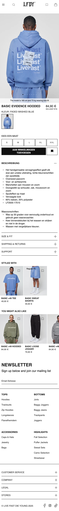
 

## Toegankelijkheidstest 1/2 (week 1)

  
uitwerken na test in 2e werkgroep

  ### Bevindingen
  tijdens het testen van de toegankelijkheid van mijn gekozen site heb ik gebruik gemaakt van de voice over functie die apple aanbiedt. ik heb verschillende pagina's geprobeerd en ik ben gaan kijken wat hier wel en niet goed aan werkt. zo ben ik er achter gekomen wat ik bij mijn eigen versie van de website beter kan maken zodat de website nog toegankelijker is. 

  Lijst met je bevindingen die in de test naar voren kwamen:
  - de afbeeldingen/iconen in de header worden niet duidelijk berschreven. er wordt verteld dat het om een link en een nav gaat maar er wordt niet verteld waar deze nav dan voor dient en waar de gebruiker naar toe gaat als hij/zij hier op klikt. 
  
  - zelf vond ik dat de besturing van de voice over tool op de site niet helemaal werkten zoals hij zou moeten. er werd niet aangegeven waar de voice over aan het lezen is en vaak wordt er niet gereageerd op de pijltjes en de tab toetsen. 
  - ook wordt alles wat de voice over voorleest twee keer verteld, de eerste keer in het nederlands en de tweede keer in het duits. dit deed de tool eigenlijk al vanaf het begin en ik heb dit dus niet ingesteld. Ik vind het zelf hierdoor erg onoverzichtelijk worden.
 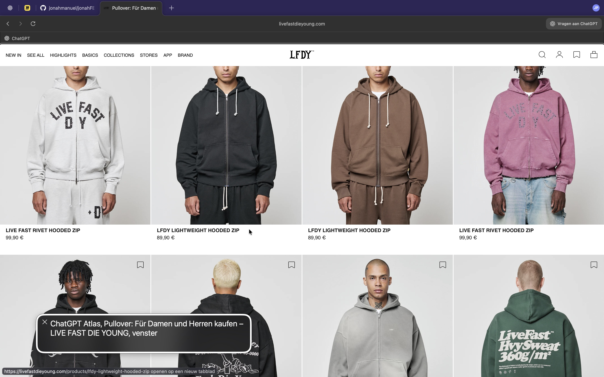

## Breakdownschets (week 1)

  
uitwerken na afloop 3e werkgroep

  ### de hele pagina: 
  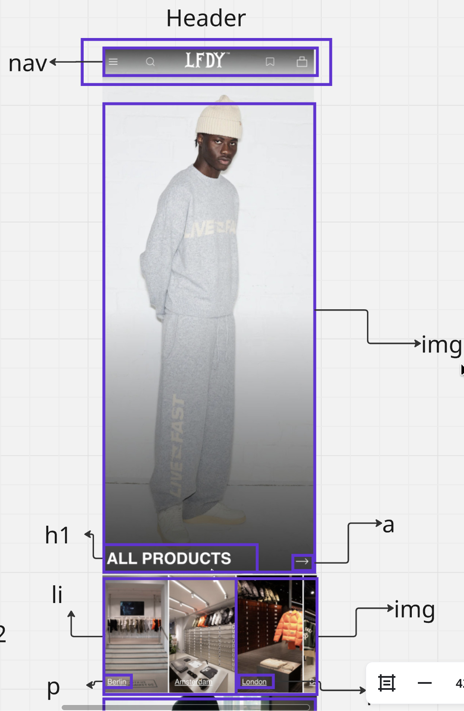

  ### dynamisch deel (bijv menu): 
  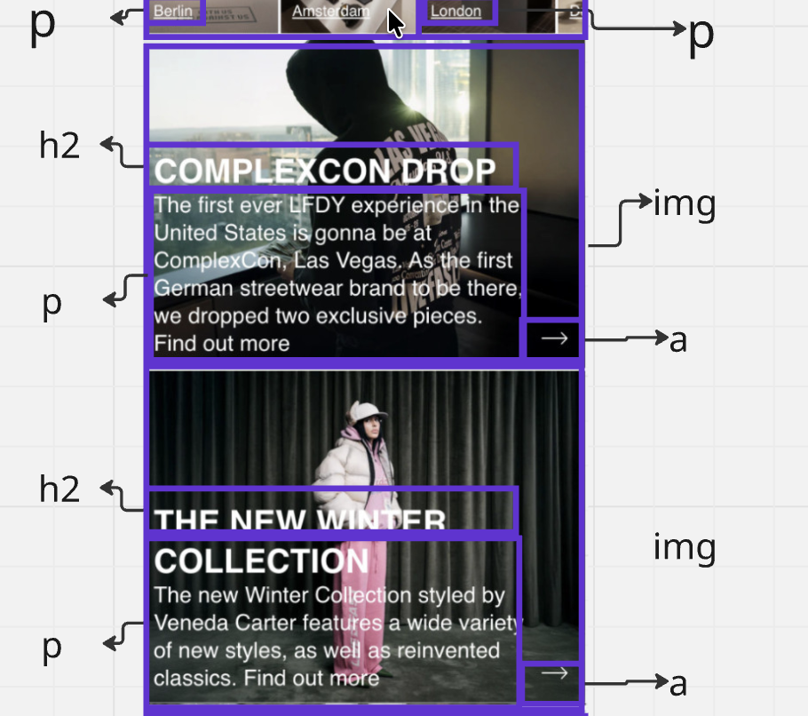

  ### wellicht nog een dynamisch deel (bijv filter): 
  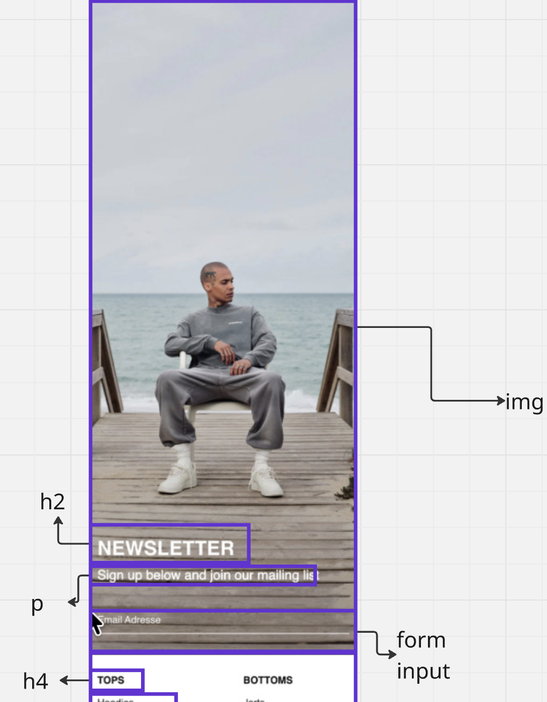

    ### wellicht nog een dynamisch deel (bijv filter): 
  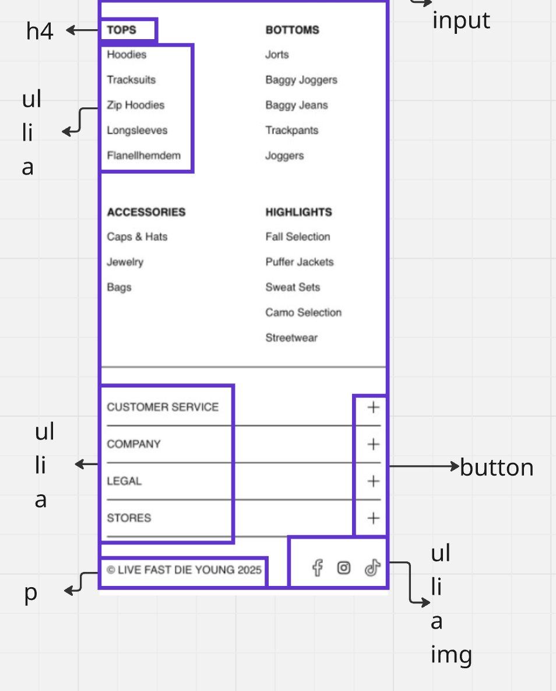

  ### wellicht nog een dynamisch deel (bijv filter): 
  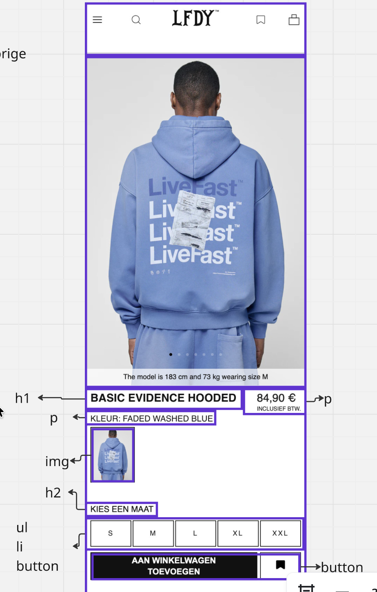

  ### wellicht nog een dynamisch deel (bijv filter): 
  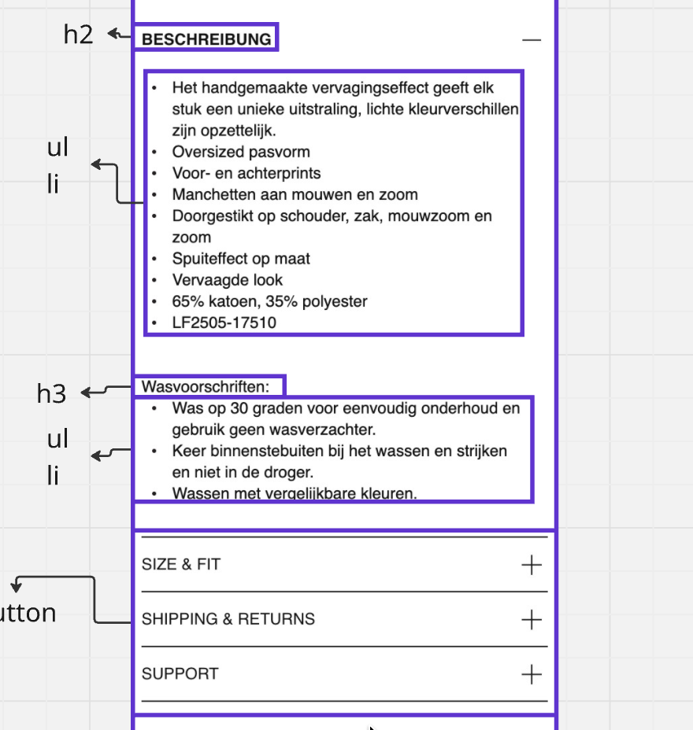

  ### wellicht nog een dynamisch deel (bijv filter): 
  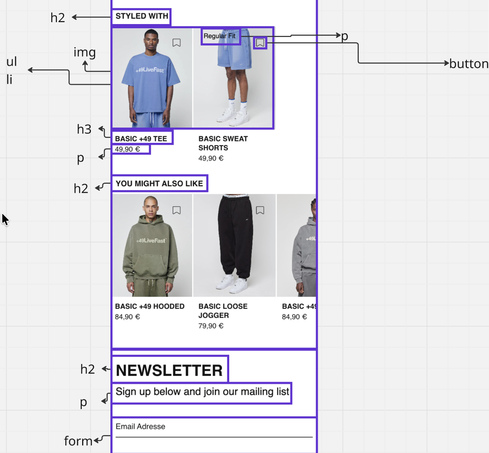

## Voortgang 1 (week 2)

  
uitwerken voor 1e voortgang

  ### Stand van zaken
  hier dit ging goed & dit was lastig (neem ook screenshots op van delen van je website en code)

  Ik vind coderen erg lastig. De oefeningetjes die we in de les hebben gedaan gingen wel, maar wanneer ik het voor mn eigen site moet gaan doen word het erg lastig. Ik heb geen goed overzicht van wat ik aan het doen ben, en ben vooral aan het proberen. Maar ik weet niet echt wat ik precies aan het doen ben. Dit vind ik vervelend. Na wat hulp van de studentassistenten is gebleken dat ik een erg lastige site heb gekozen. 

  Ik heb tot nu toe mijn hele html van de homepage en wat css geschreven. dit ging wel redelijk met behulp van mijn breakdownschets. Maar toen ik eenmaal aan de css begon ging het stroef. Heel veel proberen, delen uitcommenten, en weer nieuwe schrijven om te kijken wat er gebeurd. 

  Mijn header heeft nu enige vormgeving, al krijg ik het icoontje van mijn menu er niet in. 
  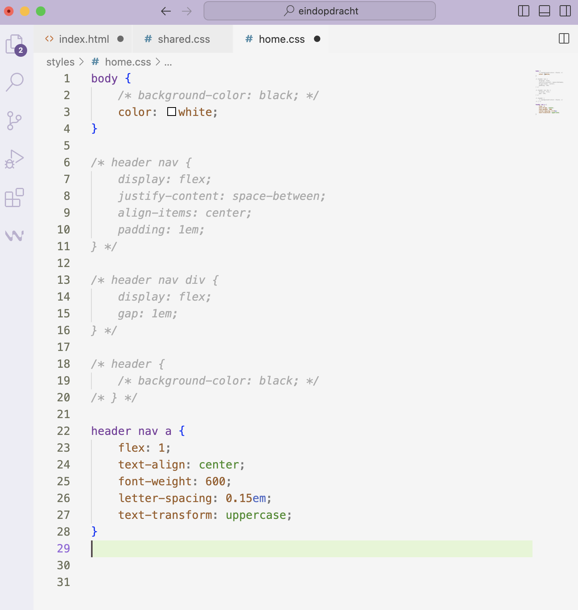

  ### Agenda voor meeting
  samen met je groepje opstellen

Selina: 
	1.	Wanneer gebruik je een 
binnen een <a> en wanneer niet? Wat is hierbij de beste en duidelijkste manier?
	2.	Hebben we onze <article> elementen op de juiste plekken gebruikt?
	3.	Is het handig dat we section:nth-of-type()gebruiken, of kunnen we beter met classes werken?
	4.	Is onze HTML-indeling en de volgorde van de kopjes (h1, h2, h3) logisch?
	5.	Gebruiken we Grid en Flexbox op de juiste manier?

Naz: Punt: 4 & 5 Selina en over header en footer
Callista: 2 & 5 van selina 
Jonah: Ook punt 4&5. Styling icoontjes in header. Hoe maak ik mijn logo groter. Ik zie het svg'tje van mn hamburgermenu niet. 

  | Selina         | Naz                | Callista    | Jonah 4        |
  | ---            | ---                | ---          | ---              |
  | dit bespreken  | en dit             | en ik dit    | en dan ik dat    |
  | en dat ook nog | dit als er tijd is | nog een punt | dit wil ik zeker |
  | ...            | ...                | ...          | ...              |

  ### Verslag van meeting
  hier na afloop snel de uitkomsten van de meeting vastleggen

  - punt 1:  Het lukte mij niet om de svg van mijn hamburgermenu in beeld te krijgen. Ook Jules en Matthijs lukte dit niet.
             Het bleek uiteindelijk aan de svg die ik van de site had gekopieerd te liggen. Ik heb vervolgens een andere 
             gepakt. 
  - punt 2  Ze hebben mij laten zien hoe ik mijn logo van grootte kan veranderen
  - nog een punt: Ik kreeg mijn icoontjes in de header niet goed gespaced. Ook dit hebben we opgelost. 
  - ...

## Voortgang 2 (week 3)

  
uitwerken voor 2e voortgang

  ### Stand van zaken
  Ik begin er nu eindelijk een beetje in te komen. Het is nogsteeds veel proberen tot het lukt, maar ergens begin ik 
  er wel plezier in te krijgen omdat het lukt. 

  ### Agenda voor meeting
  samen met je groepje opstellen

  Selina: heeft vragen over haar button en linkjes. 
  Naz: Caroussel verdwijnt en header verdwijnt onder haar foto's. Haar foto's tijdens het scrollen en nog over een section in haar productpagina.
  Jonah: Hoe zorg ik ervoor dat de foto's in mijn caroussel niet verslepen als je wil scrollen in de caroussel? en dezelfde vraag over nog een
        caroussel op mijn productpagina. 
  Callista:

  | Naz          | naz        | student 3    | student 4        |
  | ---            | ---                | ---          | ---              |
  | dit bespreken  | en dit             | en ik dit    | en dan ik dat    |
  | en dat ook nog | dit als er tijd is | nog een punt | dit wil ik zeker |
  | ...            | ...                | ...          | ...              |

  ### Verslag van meeting
  hier na afloop snel de uitkomsten van de meeting vastleggen

  - punt 1
  - punt 2
  - nog een punt
- ...

## Toegankelijkheidstest 2/2 (week 4)

  
uitwerken na test in 9e werkgroep

  ### Bevindingen
  Lijst met je bevindingen die in de test naar voren kwamen (geef ook aan wat er verbeterd is):
Ik heb duidelijke alt teksten toegevoegd. op de echte site worden afbeeldingen en iconen niet goed beschreven door de screenreader. Op de echte site krijg je "nav, image, link".
ik heb aria labels toegevoegd voor iconen en knoppen. Op de echte site staat er alleen button. 
Ik heb de focus styles verbeterd voor toetsenbord gebruikers. 
Ik heb een juiste heading structuur gebruikt. 
knoppen en links zijn duidelijk benoemd nu, op de echte site zijn er knoppen zonder tekst. 
De echte site heeft geen light en dark mode. die heb ik nu wel 

## Voortgang 3 (week 4)

  
uitwerken voor 3e voortgang

  ### Stand van zaken
  hier dit ging goed & dit was lastig (neem ook screenshots op van delen van je website en code)

  ### Agenda voor meeting
  samen met je groepje opstellen

  | student 1      | student 2          | student 3    | student 4        |
  | ---            | ---                | ---          | ---              |
  | dit bespreken  | en dit             | en ik dit    | en dan ik dat    |
  | en dat ook nog | dit als er tijd is | nog een punt | dit wil ik zeker |
  | ...            | ...                | ...          | ...              |

  ### Verslag van meeting
  hier na afloop snel de uitkomsten van de meeting vastleggen

Ik heb vlak voor dit gesprek de keuze gemaakt om opnieuw met mijn css te beginnen
Ik had het niet volgens de regels gedaan, dus ik had hier uiteindelijk niet veel vragen. eigenlijk geen.

## Eindgesprek (week 5)

  
uitwerken voor eindgesprek

  ### Je uitkomst - karakteristiek screenshots:
  \
    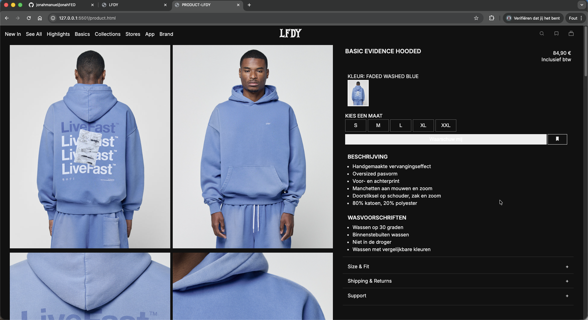

  ### Dit ging goed/Heb ik geleerd: 
  Korte omschrijving met plaatjes
Ik had eigenlijk nog helemaal geen basis. De vakken waar we vorig jaar bij moesten coderen heb ik maar net gered. En toen begreep ik er al weinig van. Ik heb nu wel het idee dat ik zeker de basis onder de knie heb. Flex en Grid vond ik op een gegeven moment wel leuk om te gebruiken. En als je uren bezig bent geweest met iets wat niet lukt, en het lukt uiteindelijk wel geeft dit een erg voldoenend gevoel. 

  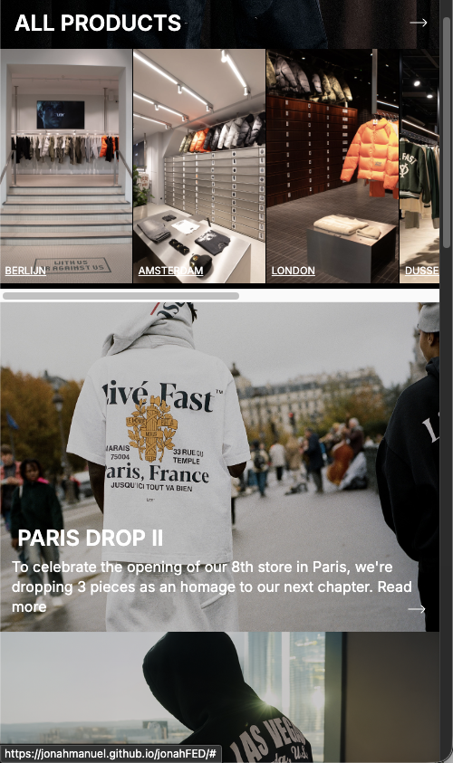

  ### Dit was lastig/Is niet gelukt:
  Korte omschrijving met plaatjes
Ik heb erg veel lopen rommelen met mijn header. Op de ene pagina moet deze wit zijn, op de andere zwart. Dit is uiteindelijk wel gelukt. Vervolgens wilde ik ervoor zorgen dat wanneer je naar benede scrollt (op de home page) dat de header terugkomt zoals hij dat nu doet. Maar dan met een witte background zoals op de echte site. Maar dit is me uiteindelijk niet gelukt. Hij komt nu wel terug, maar zonder achtergrond dus deze is niet goed te zien. Verder vind ik dit echt een moeilijk vak, en mijn passie ligt er niet. Als er vragen aan mij worden gesteld in de les heb ik geen idee wat ik moet antwoorden ookal volg ik wel alles en probeer ik het toe te passen. Nogsteeds heb ik moeite met begrijpen wat ik nou heb gedaan. Ookal is het wel gelukt na lang ploeteren. In dark mode heb ik de "waarschuw" button niet kunnen fixen. 

  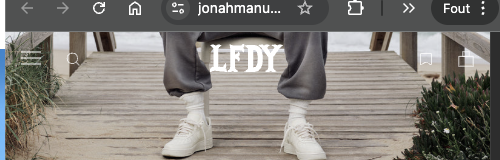
  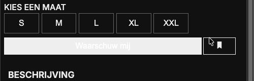

## Bronnenlijst

  
continu bijhouden terwijl je werkt

  Nb. Wees specifiek ('css-tricks' als bron is bijv. niet specifiek genoeg). 
  Nb. ChatGpT en andere AI horen er ook bij.
  Nb. Vermeld de bronnen ook in je code.

  1. https://developer.mozilla.org/en-US/docs/Web/CSS/:focus-visible
  2. https://developer.mozilla.org/en-US/docs/Web/Accessibility/ARIA/Attributes/aria-label
  3.  https://www.a11yproject.com/posts/how-to-hide-content/
  4. https://stackoverflow.com/questions/9280258/prevent-page-scrolling-when-a-modal-is-open
  5. chatgpt voor ondersteuning en verbetering

